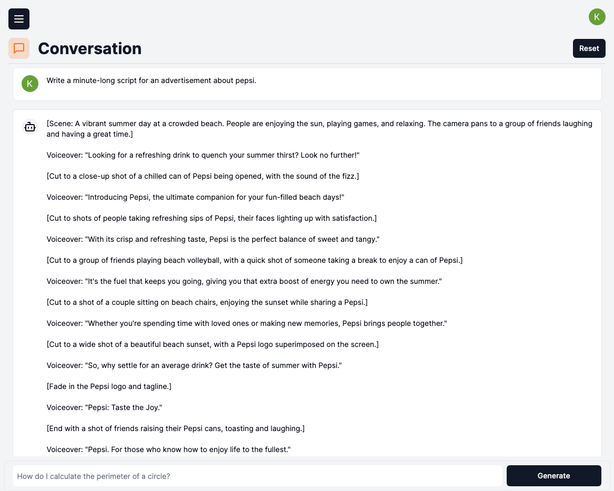
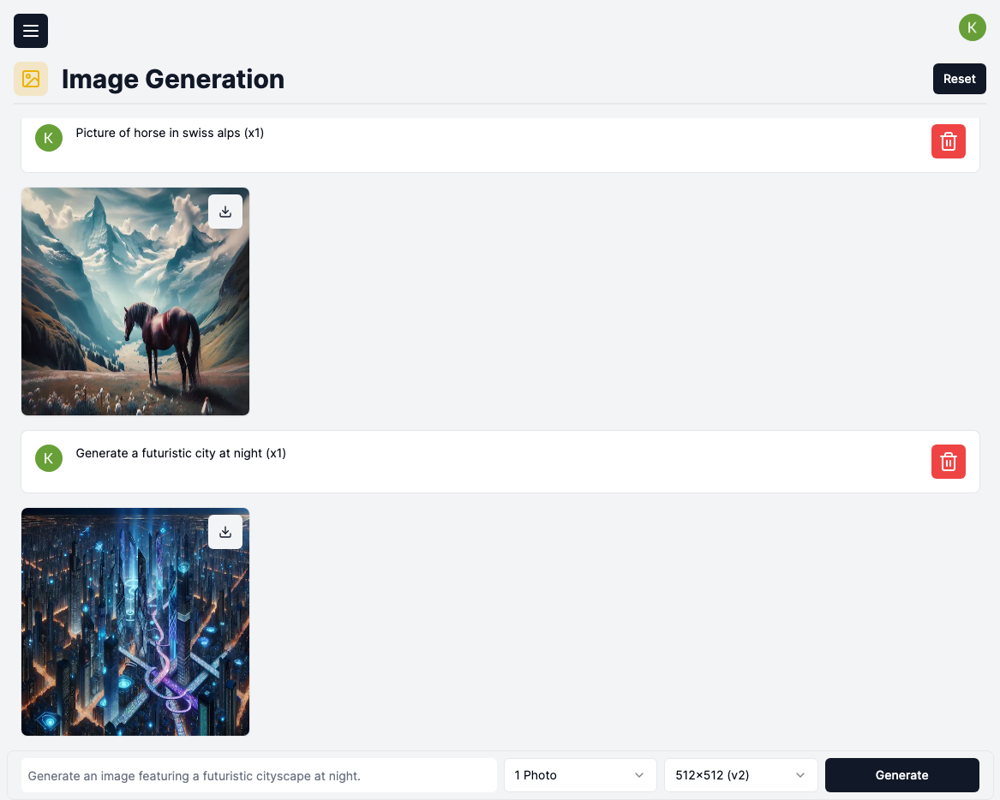
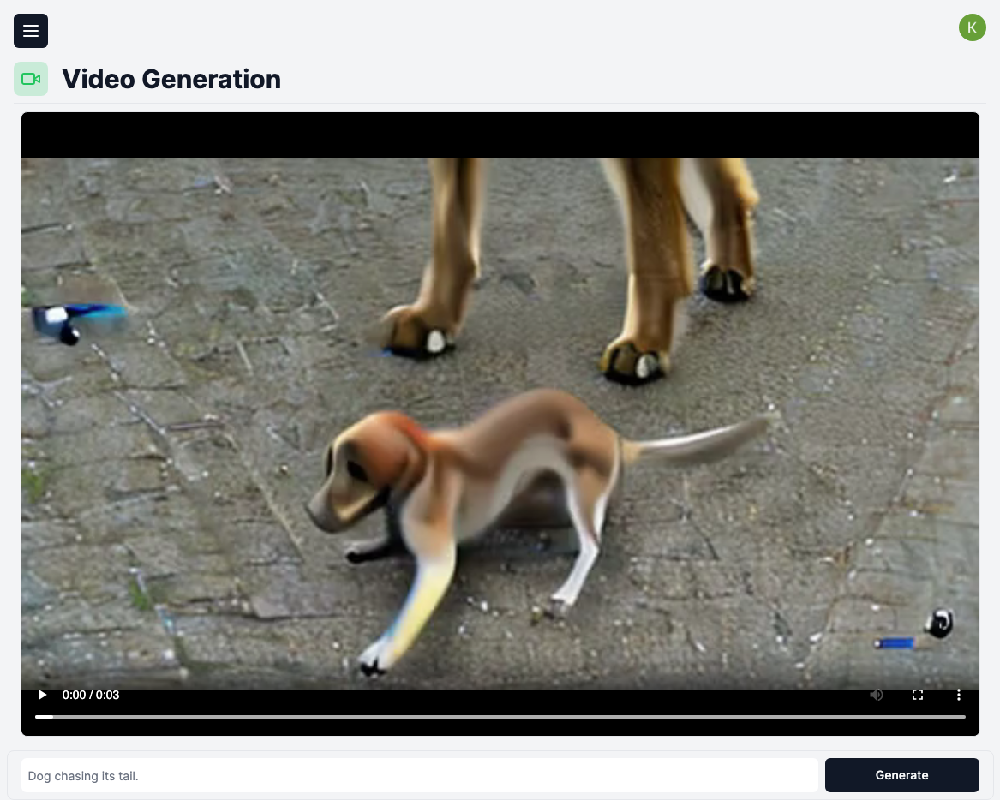
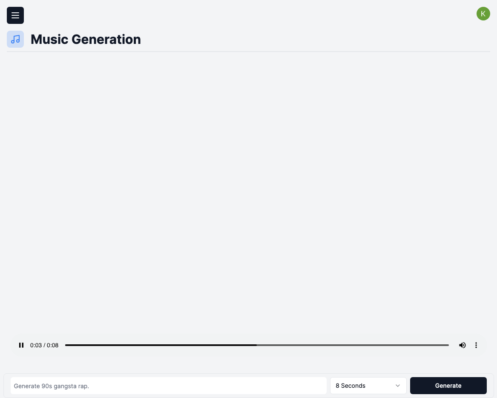
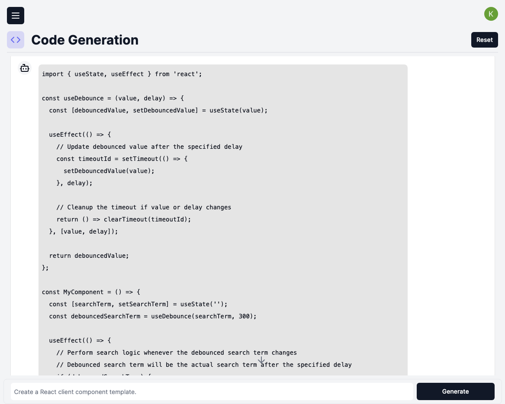

# AI SaaS Platform

Welcome to our AI SaaS Platform, your all-in-one solution for generating dynamic content including conversations, images, videos, music, and code snippets. Our platform leverages cutting-edge artificial intelligence algorithms to provide seamless and high-quality content generation tailored to your needs.

## Key Features

### Content Generation

- **Conversation**: Generate realistic and engaging conversations between virtual characters or users.
- **Images**: Create stunning images tailored to your specifications using advanced image generation techniques.
- **Videos**: Generate professional-quality videos with custom settings, themes, and styles.
- **Music**: Compose original music tracks or remix existing ones with our AI-powered music generation tools.
- **Code**: Automatically generate code snippets for various programming languages based on specific requirements.

### Customization Options

- **Initial Context Prompt**: Provide an initial context prompt to guide the content generation process and ensure that the generated content aligns with your specific requirements and preferences.
- **Parameters and Settings**: Fine-tune the generation process by adjusting parameters and settings according to your needs.

## Deployment URL

The AI SaaS platform is deployed and accessible at: [http://aisaas.eastus.cloudapp.azure.com](http://aisaas.eastus.cloudapp.azure.com)

I ran both the Next.js application and the postgres database using a Kubernetes cluster on an Azure VM.

## Run AI SaaS (Yourself)

- **`docker-compose up`**: This command orchestrates the startup of Docker containers as defined in the `compose.yaml` file. It's commonly used to start all the services and dependencies required for the AI SaaS platform, such as databases, message brokers, or other microservices.

- **`npx drizzle-kit studio`**: This command starts the Drizzle Kit Studio, which is a graphical user interface (GUI) tool used for managing and developing applications built with Drizzle, a framework or toolset used in the project.

- **`npm run dev`**: This command starts the development server for the Npm framework. Npm is likely the framework or toolset used for developing the AI SaaS platform. Running the development server enables developers to preview and test their changes in a local environment before deploying them to production.

These commands are essential for running and developing the AI SaaS platform locally, providing a streamlined workflow for development and testing. Adjustments or additional commands may be necessary based on the specific setup and requirements of your project.

### Env Variables

- NEXT_PUBLIC_CLERK_PUBLISHABLE_KEY=
- CLERK_SECRET_KEY=
- NEXT_PUBLIC_CLERK_SIGN_IN_URL=
- NEXT_PUBLIC_CLERK_SIGN_UP_URL=
- NEXT_PUBLIC_CLERK_AFTER_SIGN_IN_URL=
- NEXT_PUBLIC_CLERK_AFTER_SIGN_UP_URL=
- OPENAI_API_KEY=
- REPLICATE_API_TOKEN=
- DB_HOST=
- DB_PORT=
- DB_NAME=
- DB_USER=
- DB_PASSWORD=

## Technologies Used

- **Azure VM**: Employed to run virtual machines for various services and applications required by the AI SaaS platform, providing flexible and scalable compute resources.
- **Azure Blob Container**: Utilized for scalable and secure storage of media files such as images, videos, and music generated by the AI SaaS platform.
- **Docker**: Employed for containerization of the application, including services like Postgres for database management and Adminer for database administration.
- **Drizzle**: Integrated for managing and developing applications, providing tools and frameworks for efficient development workflows.
- **OpenAI / Replicate API**: Leveraged for accessing advanced AI capabilities, such as generating conversation, images, videos, music, and code snippets, through the Replicate API provided by OpenAI.

## Screenshots

#### Conversation Page

#### Image Page

#### Video Page

#### Music Page

#### Code Page

## License

This project is licensed under the [MIT License](https://opensource.org/licenses/MIT).

## Contact

If you have any questions or suggestions, please feel free to reach out:

- Email: kpirabaharan3@gmail.com
- LinkedIn: [https://linkedin.com/in/kpirabaharan/](https://linkedin.com/in/kpirabaharan/)
